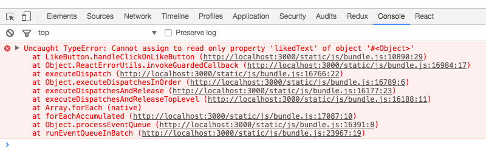

# 配置组件的 props

组件是相互独立、可复用的单元，一个组件可能在不同地方被用到。但是在不同的场景下对这个组件的需求可能会根据情况有所不同，例如一个点赞按钮组件，在我这里需要它显示的文本是“点赞”和“取消”，当别的同事拿过去用的时候，却需要它显示“赞”和“已赞”。如何让组件能适应不同场景下的需求，我们就要让组件具有一定的“可配置”性。

 React.js 的 `props` 就可以帮助我们达到这个效果。每个组件都可以接受一个 `props` 参数，它是一个对象，包含了所有你对这个组件的配置。就拿我们点赞按钮做例子：

<a href="_images/B7575C67-64F8-4A13-9C63-4D6805FA360D.png" target="_blank"></a>

下面的代码可以让它达到上述的可配置性：

```javascript
class LikeButton extends Component {
  constructor () {
    super()
    this.state = { isLiked: false }
  }

  handleClickOnLikeButton () {
    this.setState({
      isLiked: !this.state.isLiked
    })
  }

  render () {
    const likedText = this.props.likedText || '取消'
    const unlikedText = this.props.unlikedText || '点赞'
    return (
      <button onClick={this.handleClickOnLikeButton.bind(this)}>
        {this.state.isLiked ? likedText : unlikedText} 👍
      </button>
    )
  }
}
```

从  `render` 函数可以看出来，组件内部是通过 `this.props`  的方式获取到组件的参数的，如果 `this.props` 里面有需要的属性我们就采用相应的属性，没有的话就用默认的属性。

那么怎么把 `props` 传进去呢？*在使用一个组件的时候，可以把参数放在标签的属性当中，所有的属性都会作为 `props` 对象的键值*：

```javascript
class Index extends Component {
  render () {
    return (
      <div>
        <LikeButton likedText='已赞' unlikedText='赞' />
      </div>
    )
  }
}
```

就像你在用普通的 HTML 标签的属性一样，可以把参数放在表示组件的标签上，组件内部就可以通过 `this.props` 来访问到这些配置参数了。

<a href="_images/1D4C87F2-9B05-47CE-8144-1154B5CB1FC3.png" target="_blank"></a>

前面的章节我们说过，JSX 的表达式插入可以在标签属性上使用。所以其实可以把任何类型的数据作为组件的参数，包括字符串、数字、对象、数组、甚至是函数等等。例如现在我们把一个对象传给点赞组件作为参数：

```javascript
class Index extends Component {
  render () {
    return (
      <div>
        <LikeButton wordings={{likedText: '已赞', unlikedText: '赞'}} />
      </div>
    )
  }
}
```

现在我们把 `likedText` 和 `unlikedText` 这两个参数封装到一个叫 `wordings` 的对象参数内，然后传入点赞组件中。大家看到 `{{likedText: '已赞', unlikedText: '赞'}}` 这样的代码的时候，不要以为是什么新语法。之前讨论过，JSX 的 `{}` 内可以嵌入任何表达式，`{{}}` 就是在 `{}` 内部用对象字面量返回一个对象而已。

这时候，点赞按钮的内部就要用 `this.props.wordings` 来获取到到参数了：

```javascript
class LikeButton extends Component {
  constructor () {
    super()
    this.state = { isLiked: false }
  }

  handleClickOnLikeButton () {
    this.setState({
      isLiked: !this.state.isLiked
    })
  }

  render () {
    const wordings = this.props.wordings || {
      likedText: '取消',
      unlikedText: '点赞'
    }
    return (
      <button onClick={this.handleClickOnLikeButton.bind(this)}>
        {this.state.isLiked ? wordings.likedText : wordings.unlikedText} 👍
      </button>
    )
  }
}
```

甚至可以往组件内部传入函数作为参数：

```javascript
class Index extends Component {
  render () {
    return (
      <div>
        <LikeButton
          wordings={{likedText: '已赞', unlikedText: '赞'}}
          onClick={() => console.log('Click on like button!')}/>
      </div>
    )
  }
}
```

这样可以通过 `this.props.onClick` 获取到这个传进去的函数，修改 `LikeButton ` 的 `handleClickOnLikeButton` 方法：

```javascript
...
  handleClickOnLikeButton () {
    this.setState({
      isLiked: !this.state.isLiked
    })
    if (this.props.onClick) {
      this.props.onClick()
    }
  }
...
```

当每次点击按钮的时候，控制台会显示 `Click on like button!` 。但这个行为不是点赞组件自己实现的，而是我们传进去的。所以，一个组件的行为、显示形态都可以用 `props` 来控制，就可以达到很好的可配置性。

## 默认配置 defaultProps
上面的组件默认配置我们是通过 `||` 操作符来实现。这种需要默认配置的情况在 React.js 中非常常见，所以 React.js 也提供了一种方式 `defaultProps`，可以方便的做到默认配置。

```javascript
class LikeButton extends Component {
  static defaultProps = {
    likedText: '取消',
    unlikedText: '点赞'
  }

  constructor () {
    super()
    this.state = { isLiked: false }
  }

  handleClickOnLikeButton () {
    this.setState({
      isLiked: !this.state.isLiked
    })
  }

  render () {
    return (
      <button onClick={this.handleClickOnLikeButton.bind(this)}>
        {this.state.isLiked
          ? this.props.likedText
          : this.props.unlikedText} 👍
      </button>
    )
  }
}
```

注意，我们给点赞组件加上了以下的代码：

```javascript
  static defaultProps = {
    likedText: '取消',
    unlikedText: '点赞'
  }
```

`defaultProps` 作为点赞按钮组件的类属性，里面是对 `props` 中各个属性的默认配置。这样我们就不需要判断配置属性是否传进来了：如果没有传进来，会直接使用 `defaultProps` 中的默认属性。 所以可以看到，在 `render` 函数中，我们会直接使用 `this.props` 而不需要再做判断。

## props 不可变
`props` 一旦传入进来就不能改变。修改上面的例子中的 `handleClickOnLikeButton` ：

```javascript
...
  handleClickOnLikeButton () {
    this.props.likedText = '取消'
    this.setState({
      isLiked: !this.state.isLiked
    })
  }
...
```

我们尝试在用户点击按钮的时候改变 `this.props.likedText` ，然后你会看到控制台报错了：

<a href="_images/F170536D-CD3B-4828-B73E-33DC883A8E99.png" target="_blank"></a>

你不能改变一个组件被渲染的时候传进来的 `props`。React.js  希望一个组件在输入确定的 `props` 的时候，能够输出确定的 UI 显示形态。如果 `props` 渲染过程中可以被修改，那么就会导致这个组件显示形态和行为变得不可预测，这样会可能会给组件使用者带来困惑。

但这并不意味着由 `props` 决定的显示形态不能被修改。组件的使用者可以*主动地通过重新渲染的方式*把新的 `props` 传入组件当中，这样这个组件中由 `props` 决定的显示形态也会得到相应的改变。

修改上面的例子的 `Index` 组件：

```javascript
class Index extends Component {
  constructor () {
    super()
    this.state = {
      likedText: '已赞',
      unlikedText: '赞'
    }
  }

  handleClickOnChange () {
    this.setState({
      likedText: '取消',
      unlikedText: '点赞'
    })
  }

  render () {
    return (
      <div>
        <LikeButton
          likedText={this.state.likedText}
          unlikedText={this.state.unlikedText} />
        <div>
          <button onClick={this.handleClickOnChange.bind(this)}>
            修改 wordings
          </button>
        </div>
      </div>
    )
  }
}
```

在这里，我们把 `Index` 的 `state` 中的 `likedText` 和 `unlikedText` 传给 `LikeButton` 。`Index` 还有另外一个按钮，点击这个按钮会通过 `setState` 修改 `Index` 的 `state` 中的两个属性。

由于 `setState` 会导致 `Index` 重新渲染，所以 `LikedButton` 会接收到新的 `props`，并且重新渲染，于是它的显示形态也会得到更新。这就是通过重新渲染的方式来传入新的 `props` 从而达到修改 `LikedButton` 显示形态的效果。

## 总结
1. 为了使得组件的可定制性更强，在使用组件的时候，可以在标签上加属性来传入配置参数。
2. 组件可以在内部通过 `this.props` 获取到配置参数，组件可以根据 `props`  的不同来确定自己的显示形态，达到可配置的效果。
3. 可以通过给组件添加类属性 `defaultProps` 来配置默认参数。
4. `props` 一旦传入，你就不可以在组件内部对它进行修改。但是你可以通过父组件主动重新渲染的方式来传入新的 `props`，从而达到更新的效果。

## 课后练习
* <a target="_blank" href="http://scriptoj.com/problems/7">打开和关闭电脑</a>


