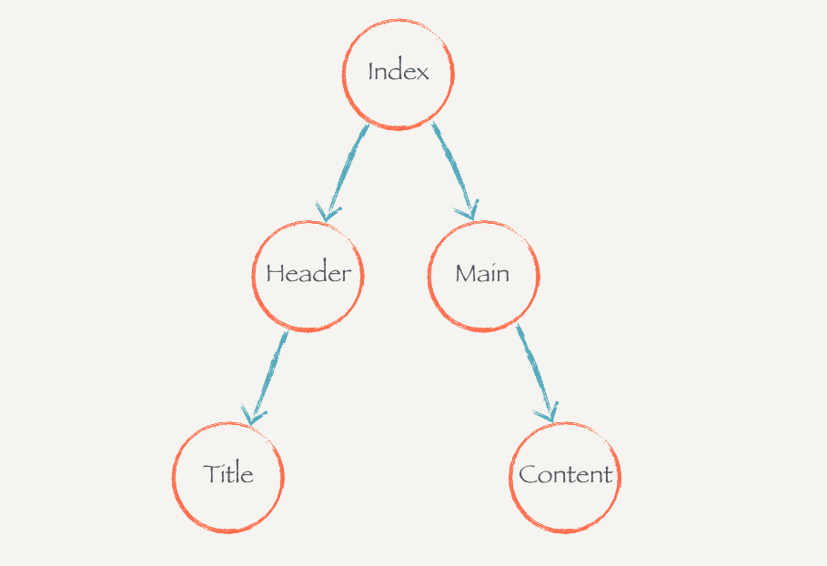
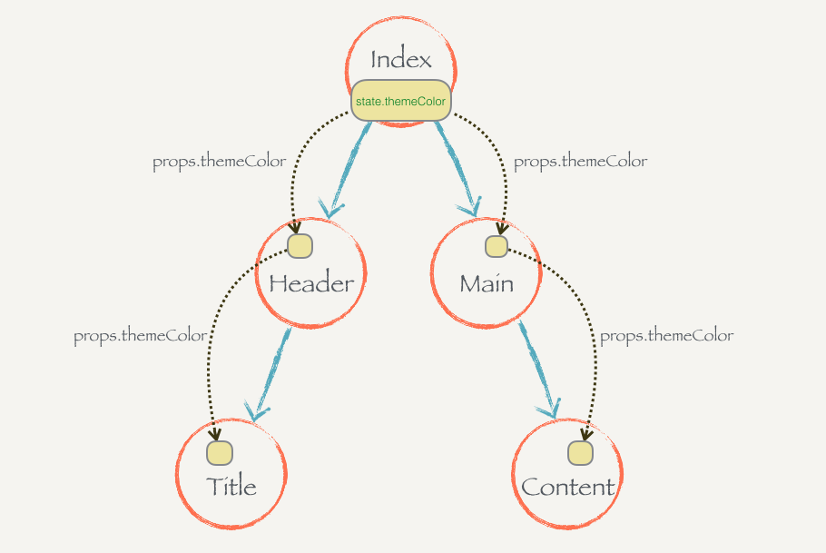
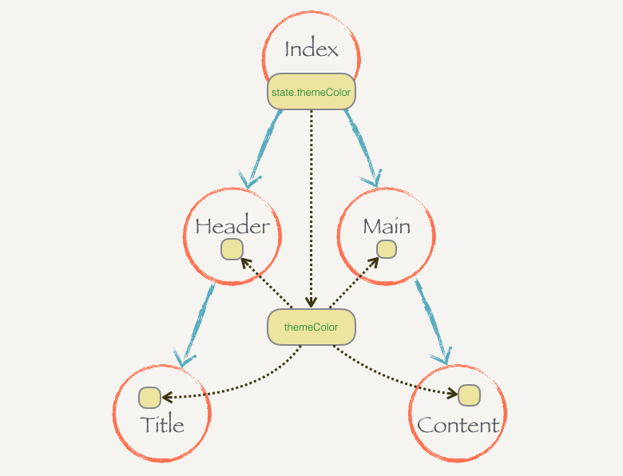
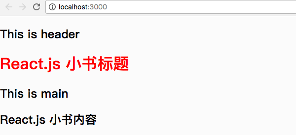

# React.js 的 context

（本文未审核）


这一节我们来介绍一个你可能永远用不上的 React.js 特性 —— context。但是了解它对于了解接下来要讲解的 React-redux 很有好处，所以大家可以简单了解一下它的概念和作用。

在过去很长一段时间里面，React.js 的 context 一直被视为一个不稳定的、危险的、可能会被去掉的特性而不被官网文档所记载。但是全世界的第三方库都在用使用这个特性，直到了 React.js 的 v0.14.1 版本，context  才被官方文档所记录。

除非你觉得自己的 React.js 水平已经比较炉火纯青了，否则你永远不要使用 context。就像你学 JavaScript 的时候，总是会被提醒不要用全局变量一样，React.js 的 context 其实像就是组件树上某颗子树的全局变量。

想象一下我们有这么一棵组件树：

<a href="_images/85C81DFF-F71E-4B2B-9BAB-AF285F3DB1DB.png" target="_blank"></a>

假设现在这个组件树代表的应用是用户可以自主换主题色的，每个子组件会根据主题色的不同调整自己的字体颜色或者背景颜色。“主题色”这个玩意是所有组件共享的状态，根据我们在 [前端应用状态管理 —— 状态提升](http://react.huziketang.com/blog/lesson17)  中所提到的，需要把这个状态提升到根节点的 `Index` 上，然后把这个状态通过 `props` 一层层传递下去：

<a href="_images/03118DDD-60E3-469A-AB78-5FBE57425E30.png" target="_blank"></a>

假设原来主题色是绿色，那么 `Index` 上保存的就是 `this.state = { themeColor: 'green' }`。如果要改变主题色，可以直接通过 `this.setState({ themeColor: 'red' })` 来进行。这样整颗组件树就会重新渲染，子组件也就可以根据重新传进来的 `props.themeColor` 来调整自己的颜色。

但这里的问题也是非常明显的，我们需要把 `themeColor` 这个状态一层层手动地从组件树顶层往下传，每层都需要写 `props.themeColor`。如果我们的组件树很层次很深的话，这样维护起来简直是灾难。

如果这颗组件树能够全局共享这个状态就好了，我们要的时候就去取这个状态，不用手动地传：

<a href="_images/3BC6BDFC-5772-4045-943B-15FBEC28DAC0.png" target="_blank"></a>

就像这样，`Index` 把 `state.themeColor` 放到某个地方，这个地方是每个 `Index` 的子组件都可以访问到的。当某个子组件需要的时候就直接去那个地方拿就好了，而不需要一层层地通过 `props` 来获取。不管组件树的层次有多深，任何一个组件都可以直接到这个公共的地方提取 `themeColor` 状态。

React.js 的 context 就是这么一个东西，某个组件只要往自己的 context 里面放了某些状态，这个组件之下的所有子组件都直接访问这个状态而不需要通过中间组件的传递。一个组件的 context 只有它的子组件能够访问，它的父组件是不能访问到的，你可以理解每个组件的 context 就是瀑布的源头，只能往下流不能往上飞。

我们看看 React.js 的 context 代码怎么写，我们先把整体的组件树搭建起来，这里不涉及到 context 相关的内容：

```javascript
class Index extends Component {
  render () {
    return (
      <div>
        <Header />
        <Main />
      </div>
    )
  }
}

class Header extends Component {
  render () {
    return (
    <div>
      <h2>This is header</h2>
      <Title />
    </div>
    )
  }
}

class Main extends Component {
  render () {
    return (
    <div>
      <h2>This is main</h2>
      <Content />
    </div>
    )
  }
}

class Title extends Component {
  render () {
    return (
      <h1>React.js 小书标题</h1>
    )
  }
}

class Content extends Component {
  render () {
    return (
    <div>
      <h2>React.js 小书内容</h2>
    </div>
    )
  }
}

ReactDOM.render(
  <Index />,
  document.getElementById('root')
)
```

代码很长但是很简单，这里就不解释了。

现在我们修改 `Index`，让它往自己的 context 里面放一个 `themeColor`：

```javascript
class Index extends Component {
  static childContextTypes = {
    themeColor: PropTypes.string
  }

  constructor () {
    super()
    this.state = { themeColor: 'red' }
  }

  getChildContext () {
    return { themeColor: this.state.themeColor }
  }

  render () {
    return (
      <div>
        <Header />
        <Main />
      </div>
    )
  }
}
```

构造函数里面的内容其实就很好理解，就是往 state 里面初始化一个 `themeColor` 状态。`getChildContext` 这个方法就是设置  `context` 的过程，它返回的对象就是 context（也就是上图中处于中间的方块），所有的子组件都可以访问到这个对象。我们用 `this.state.themeColor` 来设置了 context 里面的 `themeColor`。

还有一个看起来很可怕的 `childContextTypes`，它的作用其实 `propsType` 验证组件 `props` 参数的作用类似。不过它是验证 `getChildContext` 返回的对象。为什么要验证 context，因为 context 是一个危险的特性，按照 React.js 团队的想法就是，把危险的事情搞复杂一些，提高使用门槛人们就不会去用了。如果你要给组件设置 context，那么 `childContextTypes` 是必写的。

现在我们已经完成了 `Index` 往 context 里面放置状态的工作了，接下来我们要看看子组件怎么获取这个状态，修改 `Index` 的孙子组件 `Title`：

```javascript
class Title extends Component {
  static contextTypes = {
    themeColor: PropTypes.string
  }

  render () {
    return (
      <h1 style={{ color: this.context.themeColor }}>React.js 小书标题</h1>
    )
  }
}
```

子组件要获取 context 里面的内容的话，就必须写 `contextTypes` 来声明和验证你需要获取的状态的类型，它也是必写的，如果你不写就无法获取 context 里面的状态。`Title` 想获取 `themeColor`，它是一个字符串，我们就在 `contextTypes` 里面进行声明。

声明以后我们就可以通过 `this.context.themeColor` 获取到在 `Index` 放置的值为 `red` 的 `themeColor`，然后设置 `h1` 的样式，所以你会看到页面上的字体是红色的：

<a href="_images/B8D755FF-79CC-4D1F-960D-7ABBF7775AF1.png" target="_blank"></a>

如果我们要改颜色，只需要在 `Index` 里面 `setState` 就可以了，子组件会重新渲染，渲染的时候会重新取 context 的内容，例如我们给 `Index` 调整一下颜色：

```javascript
...
  componentWillMount () {
    this.setState({ themeColor: 'green' })
  }
...
```

那么 `Title` 里面的字体就会显示绿色。我们可以如法炮制孙子组件 `Content`，或者任意的 `Index` 下面的子组件。让它们可以不经过中间 `props` 的传递获就可以获取到由 `Index` 设定的 context 内容。

## 总结
一个组件可以通过 `getChildContext` 方法返回一个对象，这个对象就是子树的 context，提供 context 的组件必须提供 `childContextTypes` 作为 context 的声明和验证。

如果一个组件设置了 context，那么它的子组件都可以直接访问到里面的内容，它就像这个组件为根的子树的全局变量。任意深度的子组件都可以通过 `contextTypes` 来声明你想要的 context 里面的哪些状态，然后可以通过 `this.context` 访问到那些状态。

context 打破了组件和组件之间通过 `props` 传递数据的规范，极大地增强了组件之间的耦合性。而且，就如全局变量一样，*context 里面的数据能被随意接触就能被随意修改*，每个组件都能够改 context 里面的内容会导致程序的运行不可预料。

但是这种机制对于前端应用状态管理来说是很有帮助的，因为毕竟很多状态都会在组件之间进行共享，context  会给我们带来很大的方便。一些第三方的前端应用状态管理的库（例如 Redux）就是充分地利用了这种机制给我们提供便利的状态管理服务。但我们一般不需要手动写 context，也不要用它，只需要用好这些第三方的应用状态管理库就行了。

## 课后练习
* <a target="_blank" href="http://scriptoj.com/problems/15">高阶组件 + context</a>


